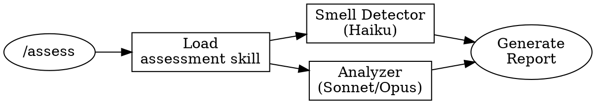

# /assess - Codebase Assessment

Perform a comprehensive assessment of the codebase to identify quality issues and refactoring opportunities.

## Usage

```
/assess              # Assess current directory
/assess src/         # Assess specific path
/assess --deep       # Deep analysis with Opus
```

## What This Command Does

1. **Invokes Assessment Skill**
   - Loads `declutter:assessment` skill
   - Follows structured assessment workflow

2. **Delegates to Analyzer Agent**
   - Default: `declutter-analyzer` (Sonnet)
   - With `--deep`: `declutter-analyzer-high` (Opus)

3. **Runs Smell Detection**
   - Delegates to `declutter-smell-detector` (Haiku)
   - Fast pattern-based scanning

4. **Generates Report**
   - Prioritized issue list
   - Complexity hotspots
   - Recommended actions

## Workflow



## Output

```markdown
# Codebase Assessment Report

## Summary
- Overall health: [Good/Fair/Poor/Critical]
- Files analyzed: N
- Total issues: M

## Complexity Hotspots
[Top problematic files ranked]

## Code Smells
[Categorized list of smells with severity]

## Recommendations
[Prioritized action items]
```

## Options

| Option | Description |
|--------|-------------|
| `--deep` | Use Opus for thorough analysis |
| `--path=X` | Analyze specific directory |
| `--format=json` | Output as JSON |

## Next Steps

After assessment:
1. Review the report
2. Approve priorities with user
3. Run `/declutter` to start refactoring
