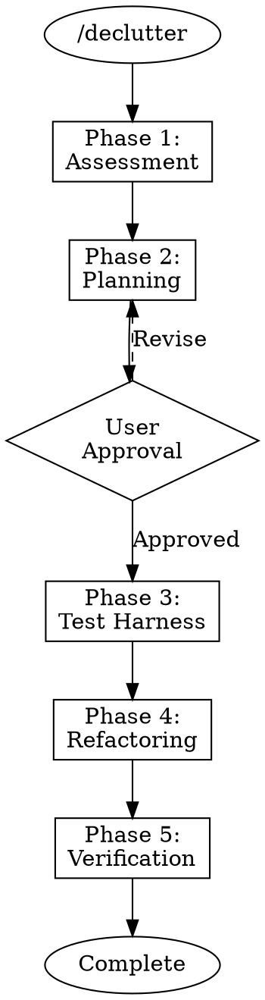

# /declutter - Refactoring Workflow

Start the complete refactoring workflow for cleaning up legacy code safely.

## Usage

```
/declutter                    # Interactive mode
/declutter src/module.py      # Target specific file
/declutter --from-assessment  # Continue from previous assessment
```

## The Iron Laws

This command enforces:

```
NO REFACTORING WITHOUT ASSESSMENT FIRST
NO CODE CHANGE WITHOUT TEST HARNESS FIRST
NO COMPLETION WITHOUT VERIFICATION FIRST
```

## What This Command Does

1. **Loads Workflow Skill**
   - Invokes `declutter:workflow` skill
   - Sets up phase-based execution

2. **Phase 1: Assessment** (if not done)
   - Runs `/assess` internally
   - Generates assessment report

3. **Phase 2: Planning**
   - Invokes `declutter:planning` skill
   - Creates TodoWrite task list
   - Gets user approval

4. **Phase 3: Test Harness**
   - Invokes `declutter:test-harness` skill
   - Delegates to `declutter-executor`
   - Creates characterization tests

5. **Phase 4: Refactoring**
   - Invokes `declutter:safe-refactoring` skill
   - Delegates to `declutter-executor`
   - ONE atomic change at a time
   - Tests after EVERY change

6. **Phase 5: Verification**
   - Invokes `declutter:verification` skill
   - Delegates to `declutter-reviewer` (Opus)
   - Confirms behavior preservation

## Workflow Diagram



## Delegation Table

| Phase | Agent | Model |
|-------|-------|-------|
| Assessment | declutter-analyzer | Sonnet |
| Smell Detection | declutter-smell-detector | Haiku |
| Execution | declutter-executor | Sonnet |
| Complex Execution | declutter-executor-high | Opus |
| Review | declutter-reviewer | Opus |

## Options

| Option | Description |
|--------|-------------|
| `--from-assessment` | Skip assessment, use existing |
| `--target=X` | Focus on specific file/module |
| `--dry-run` | Plan only, don't execute |
| `--high` | Use Opus agents throughout |

## Safety Features

- **Atomic commits:** Each change committed separately
- **Test verification:** Tests run after every change
- **Rollback ready:** Easy revert if issues arise
- **Progress tracking:** TodoWrite shows current state

## Example Session

```
User: /declutter src/legacy/

Claude: Starting Declutter workflow...

Phase 1: Assessment
- Running smell detection...
- Analyzing code structure...
- Report generated.

[Assessment Report shown]

Phase 2: Planning
Based on the assessment, I recommend:
1. Extract AuthService from UserController (High priority)
2. Remove duplicate validation logic (Medium priority)
3. Rename unclear variables (Low priority)

Approve this plan? [Yes/Revise/Cancel]

User: Yes

Phase 3: Test Harness
- Creating characterization tests for UserController...
- All tests passing (12 tests)

Phase 4: Refactoring
[Task 1/3] Extracting AuthService...
- Change applied
- Tests: PASSING
- Committed: abc123

[Task 2/3] Removing duplicates...
...

Phase 5: Verification
- All tests passing
- No new smells introduced
- Complexity reduced by 35%

VERIFICATION_COMPLETE

Refactoring complete!
```
