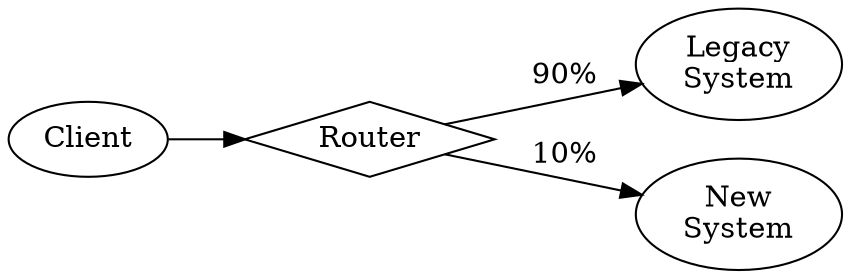
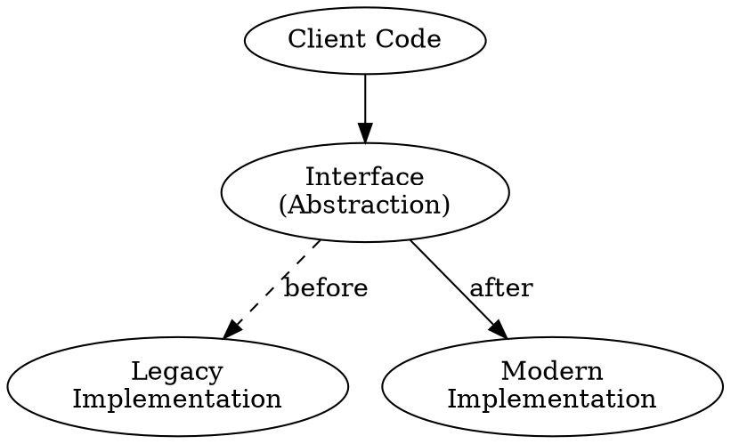

# /migrate - Incremental Migration

Start an incremental migration workflow for moving legacy code to modern patterns.

## Usage

```
/migrate                          # Interactive mode
/migrate strangler                # Use Strangler Fig pattern
/migrate branch-by-abstraction    # Use Branch by Abstraction
/migrate --language=python        # Python-specific migration
/migrate --framework=react        # React-specific migration
```

## Migration Strategies

### Strangler Fig Pattern

Gradually replace legacy system by:
1. Creating new implementation alongside old
2. Routing traffic incrementally to new
3. Removing old when fully migrated



### Branch by Abstraction

Migrate implementation behind abstraction:
1. Create abstraction layer
2. Implement abstraction with legacy code
3. Create new implementation
4. Switch to new implementation
5. Remove legacy



## Language-Specific Migrations

### Python Modernization
- Python 2 → Python 3
- Type hints addition
- async/await conversion
- dataclasses adoption

### TypeScript Strict Mode
- Enable strict flags incrementally
- Add missing type annotations
- Fix implicit any errors
- Enable strictNullChecks

### React Modernization
- Class components → Hooks
- PropTypes → TypeScript
- Redux → Context/Zustand
- Lifecycle methods → useEffect

## Migration Phases

### Phase 1: Analysis
- Identify migration scope
- Map dependencies
- Assess risk areas

### Phase 2: Abstraction
- Create interfaces/boundaries
- Ensure tests at boundaries
- Verify abstraction works

### Phase 3: Parallel Implementation
- Build new alongside old
- Compare behavior
- Validate equivalence

### Phase 4: Incremental Cutover
- Route small portion to new
- Monitor for issues
- Gradually increase

### Phase 5: Cleanup
- Remove legacy code
- Clean up routing
- Update documentation

## Options

| Option | Description |
|--------|-------------|
| `--strategy=X` | strangler, branch-by-abstraction |
| `--language=X` | python, typescript, java |
| `--framework=X` | react, vue, angular |
| `--scope=X` | Limit migration scope |
| `--dry-run` | Plan only |

## Safety Features

- **Parallel running:** Compare old/new behavior
- **Feature flags:** Control rollout
- **Monitoring:** Track metrics during migration
- **Rollback:** Quick switch back if issues

## Example Session

```
User: /migrate strangler --scope=auth

Claude: Starting Strangler Fig migration for auth module...

Phase 1: Analysis
- Legacy auth in: src/legacy/auth/
- Entry points: 3 (login, logout, verify)
- Dependencies: database, cache, email
- Risk: Medium (critical path)

Phase 2: Planning
Migration plan:
1. Create AuthService interface
2. Implement interface with legacy code
3. Create new implementation
4. Add routing layer
5. Migrate login endpoint (10% traffic)
6. ... gradually increase ...
7. Remove legacy when 100%

Approve? [Yes/Revise/Cancel]

User: Yes

Phase 3: Implementation
[Step 1] Creating AuthService interface...
- Interface created
- Tests: PASSING

[Step 2] Wrapping legacy...
...

Migration in progress. Current routing: 10% new, 90% legacy.
Monitor at: /status/migration/auth
```

## Monitoring

During migration:

```markdown
# Migration Status: auth

## Routing
- Legacy: 90%
- Modern: 10%

## Metrics (Last 24h)
| Metric | Legacy | Modern |
|--------|--------|--------|
| Requests | 9000 | 1000 |
| Errors | 12 | 1 |
| Latency p99 | 120ms | 45ms |

## Status
Migration proceeding normally.
Recommend increasing to 25% modern.
```
