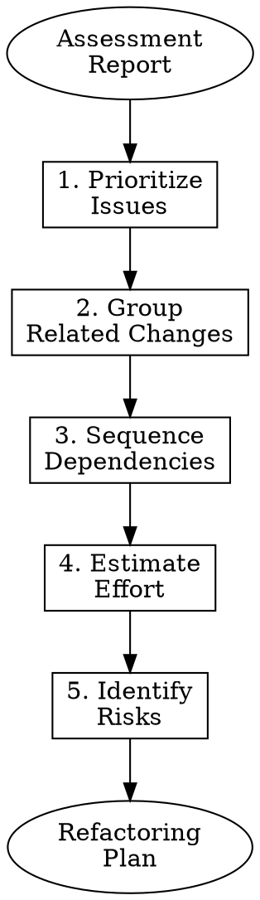

# Refactoring Planning

## Purpose

Create a structured, prioritized plan for refactoring that balances risk, effort, and value.

## Planning Principles

1. **Start with the biggest pain point** - Address what hurts most first
2. **Prefer small, safe changes** - Many small wins over big rewrites
3. **Maintain working software** - Never break the build for long
4. **Get quick feedback** - Validate often, adjust plan as needed

## Planning Process



## Step 1: Prioritize Issues

Use this matrix to prioritize:

```
                    HIGH IMPACT
                         │
    ┌────────────────────┼────────────────────┐
    │                    │                    │
    │   QUICK WINS       │    MAJOR           │
    │   Do First         │    PROJECTS        │
    │                    │    Plan Carefully  │
    │                    │                    │
LOW ├────────────────────┼────────────────────┤ HIGH
EFFORT                   │                    │ EFFORT
    │                    │                    │
    │   FILL-IN          │    DON'T DO        │
    │   If Time Allows   │    (Usually)       │
    │                    │                    │
    │                    │                    │
    └────────────────────┼────────────────────┘
                         │
                    LOW IMPACT
```

### Priority Categories

| Priority | Criteria | Action |
|----------|----------|--------|
| P0 | Blocks development | Fix immediately |
| P1 | High impact, low effort | This sprint |
| P2 | High impact, high effort | Plan and schedule |
| P3 | Low impact, low effort | Opportunistic |
| P4 | Low impact, high effort | Probably never |

## Step 2: Group Related Changes

Identify changes that should be done together:

```markdown
## Group: User Authentication Refactoring

### Changes:
1. Extract AuthService from UserController
2. Move password validation to AuthService
3. Add dependency injection for AuthService

### Reason:
These changes affect the same area and have dependencies.
Doing them together minimizes integration risk.
```

## Step 3: Sequence Dependencies

Create a dependency graph:

```markdown
## Refactoring Sequence

1. **Extract Constants** (no dependencies)
   - Move magic numbers to config

2. **Add Interface** (depends on: none)
   - Create IUserRepository interface

3. **Extract Repository** (depends on: 2)
   - Move database calls to UserRepository

4. **Inject Dependencies** (depends on: 2, 3)
   - Use dependency injection for repository
```

## Step 4: Break Into Atomic Tasks

Each task should be:
- Completable in one sitting
- Independently testable
- Independently deployable
- Describable in one sentence

### Task Template

```markdown
### Task: Extract validatePassword method

**File:** src/controllers/user_controller.py
**Lines:** 145-178

**Current State:**
Password validation logic mixed with login flow

**Target State:**
Separate `validate_password(password: str) -> bool` method

**Steps:**
1. Write characterization test for current behavior
2. Extract method using IDE refactoring
3. Run tests
4. Commit

**Risks:** Low - mechanical extraction
**Effort:** 15 minutes
```

## Step 5: Create TodoWrite Tasks

Convert plan to TodoWrite format:

```markdown
## Refactoring Plan: User Authentication

- [ ] Phase 1: Test Harness
  - [ ] Write characterization tests for login flow
  - [ ] Write characterization tests for registration flow
  - [ ] Verify all tests pass

- [ ] Phase 2: Extract Methods
  - [ ] Extract validatePassword from login
  - [ ] Extract hashPassword from registration
  - [ ] Extract validateEmail from registration

- [ ] Phase 3: Extract Service
  - [ ] Create AuthService class
  - [ ] Move extracted methods to AuthService
  - [ ] Update controllers to use AuthService

- [ ] Phase 4: Verification
  - [ ] All tests pass
  - [ ] No new smells
  - [ ] Complexity reduced
```

## Risk Assessment

For each major change, document:

| Risk | Likelihood | Impact | Mitigation |
|------|------------|--------|------------|
| Break login flow | Medium | High | Characterization tests |
| Performance regression | Low | Medium | Benchmark before/after |
| Merge conflicts | High | Low | Rebase frequently |

## Plan Template

```markdown
# Refactoring Plan: [Area Name]

## Objective
[What we're trying to achieve]

## Scope
- **In scope:** [What's included]
- **Out of scope:** [What's NOT included]

## Success Criteria
- [ ] [Measurable goal 1]
- [ ] [Measurable goal 2]

## Prerequisites
- [ ] Assessment complete
- [ ] Team notified
- [ ] Branch created

## Phase 1: [Name]
### Tasks
- [ ] Task 1
- [ ] Task 2

### Exit Criteria
- [ ] Tests pass
- [ ] Code review approved

## Phase 2: [Name]
...

## Risks and Mitigations
| Risk | Mitigation |
|------|------------|
| ... | ... |

## Rollback Plan
If critical issues arise:
1. git revert to last known good state
2. Notify team
3. Post-mortem analysis

## Timeline
- Phase 1: [X tasks]
- Phase 2: [Y tasks]
- Total: [Z tasks]
```

## Checklist

```markdown
- [ ] All issues prioritized
- [ ] Related changes grouped
- [ ] Dependencies sequenced
- [ ] Tasks are atomic
- [ ] Risks identified
- [ ] Mitigations planned
- [ ] Rollback plan defined
- [ ] User approved plan
```

## Signal

When plan is approved, emit:

```
PLAN_APPROVED
```
