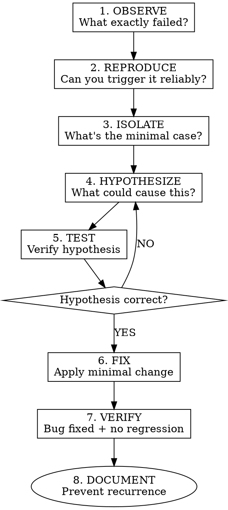

# Systematic Debugging

## The Iron Law

```
╔═══════════════════════════════════════════════════════════════════╗
║  NO FIX WITHOUT REPRODUCING THE BUG FIRST                        ║
║  NO FIX WITHOUT UNDERSTANDING ROOT CAUSE                         ║
║  NO FIX WITHOUT REGRESSION TEST                                  ║
╚═══════════════════════════════════════════════════════════════════╝
```

## The Debugging Process



## Step 1: OBSERVE

Gather all available information:

```markdown
## Bug Observation

**What failed:**
- Test name: `test_user_login`
- Error message: `AssertionError: expected 200, got 401`
- Stack trace: [paste here]

**When it started:**
- Last known working commit: abc123
- First failing commit: def456

**Environment:**
- Python version: 3.11
- OS: macOS
- Dependencies changed: None
```

## Step 2: REPRODUCE

Create reliable reproduction:

```markdown
## Reproduction Steps

1. Run `pytest test_auth.py::test_user_login`
2. Observe failure

**Reproduction rate:** 100% (always fails)

**Minimal reproduction:**
```python
def test_minimal_reproduction():
    result = login(username="test", password="test123")
    assert result.status_code == 200  # Fails with 401
```
```

### If Cannot Reproduce

- Check environment differences
- Look for race conditions
- Check for state pollution between tests
- Look for time-dependent behavior

## Step 3: ISOLATE

Find the minimal failing case:

```markdown
## Isolation

**Binary search through changes:**
1. Revert to last working commit: PASS
2. Apply half the changes: PASS
3. Apply next quarter: FAIL
4. Narrow down to specific change

**Guilty change:**
- Commit: def456
- File: src/auth/validator.py:23
- Change: Renamed `verify_password` to `validate_password`
```

### Isolation Techniques

| Technique | When to Use |
|-----------|-------------|
| Git bisect | Regression in known range |
| Binary search | Large changeset |
| Comment out code | Unknown failure location |
| Logging | Need execution trace |
| Debugger | Complex state issues |

## Step 4: HYPOTHESIZE

Form testable theories:

```markdown
## Hypotheses

1. **Rename broke call site**
   - Theory: A caller still uses old name `verify_password`
   - Test: Search for `verify_password` in codebase

2. **Import not updated**
   - Theory: Some module imports old name
   - Test: Check all imports of validator module

3. **Cached bytecode**
   - Theory: Old .pyc file being used
   - Test: Delete __pycache__ and retry
```

## Step 5: TEST Hypothesis

Verify each theory systematically:

```markdown
## Hypothesis Testing

### Hypothesis 1: Rename broke call site
- Search result: Found `verify_password` in `user_service.py:45`
- **CONFIRMED**

### Root Cause
The rename refactoring missed `user_service.py` which still calls
`verify_password` (old name) instead of `validate_password` (new name).
```

## Step 6: FIX

Apply the minimal fix:

```markdown
## Fix

**File:** src/services/user_service.py
**Line:** 45
**Change:** Replace `verify_password` with `validate_password`

**Why minimal:**
- Only changes what's broken
- No unrelated improvements
- Easy to review and verify
```

### Fix Principles

- **One bug, one fix** - Don't bundle other changes
- **Minimal change** - Change only what's needed
- **Same style** - Match existing code style
- **No new features** - Fix the bug, nothing more

## Step 7: VERIFY

Confirm the fix works:

```markdown
## Verification

- [ ] Original test passes: ✓
- [ ] All related tests pass: ✓
- [ ] No new warnings: ✓
- [ ] No regression in other areas: ✓

**Test command:** `pytest test_auth.py -v`
**Result:** All 15 tests passed
```

## Step 8: DOCUMENT

Prevent recurrence:

```markdown
## Post-Mortem

**Bug:** Login failed after rename refactoring
**Root Cause:** Incomplete rename - missed call site in user_service.py
**Fix:** Updated call site to use new name
**Prevention:**
- Use IDE "Rename Symbol" feature instead of find-replace
- Add pre-commit check for broken imports
- Consider adding import linting to CI

**Commit message:**
```
fix: Update verify_password call site after rename

The refactoring in def456 renamed verify_password to validate_password
but missed the call site in user_service.py, causing login to fail.

This updates the remaining call site.

Fixes: #123
```
```

## Red Flags - STOP

| Thought | Reality |
|---------|---------|
| "I know what's wrong" | Reproduce it first. You might be wrong. |
| "Let me try this fix" | Understand root cause first. |
| "It works on my machine" | Investigate environment differences. |
| "Just restart the service" | That's not a fix, it's a workaround. |
| "I'll fix multiple things at once" | One fix per bug. Always. |

## Common Debugging Mistakes

1. **Fixing symptoms, not cause** → Keep asking "why?"
2. **Changing random things** → Systematic hypothesis testing
3. **Not reproducing first** → You can't verify a fix without reproduction
4. **Skipping verification** → Always run full test suite after fix
5. **Not documenting** → Same bug will happen again

## Debugging Checklist

```markdown
- [ ] Bug observed and documented
- [ ] Reproduction steps identified
- [ ] Bug reliably reproducible
- [ ] Minimal failing case found
- [ ] Hypotheses formed
- [ ] Root cause identified
- [ ] Minimal fix applied
- [ ] Original test passes
- [ ] No regressions introduced
- [ ] Fix documented
- [ ] Prevention measures identified
```
