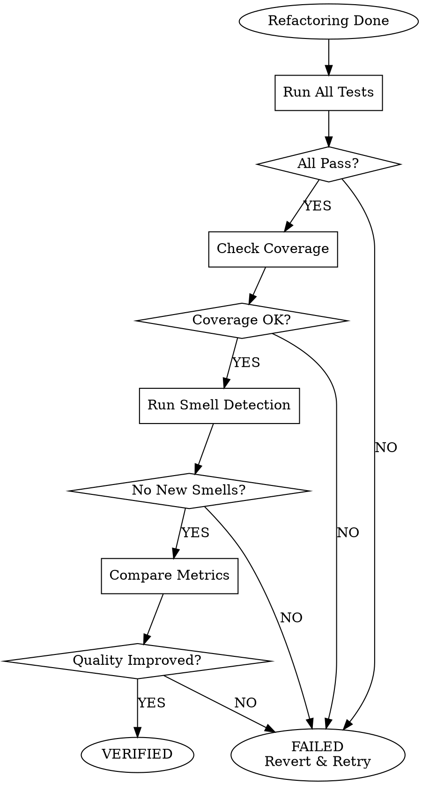

# Refactoring Verification

## The Verification Rule

```
╔═══════════════════════════════════════════════════════════════════╗
║  NO COMPLETION CLAIM WITHOUT VERIFICATION EVIDENCE               ║
╚═══════════════════════════════════════════════════════════════════╝
```

## Purpose

Systematically verify that refactoring achieved its goals without breaking existing functionality.

## Verification Checklist

### 1. Behavior Preservation

```markdown
- [ ] All characterization tests pass
- [ ] All existing unit tests pass
- [ ] All integration tests pass
- [ ] All E2E tests pass
- [ ] No new test failures introduced
```

**Command:**
```bash
# Run full test suite
npm test          # or
pytest            # or
go test ./...     # etc.
```

### 2. No Regression

```markdown
- [ ] Test coverage maintained or improved
- [ ] No new compiler/linter warnings
- [ ] No new runtime warnings
- [ ] Performance not degraded (if applicable)
```

**Commands:**
```bash
# Coverage check
pytest --cov --cov-fail-under=80
npm run test:coverage

# Lint check
npm run lint
pylint src/
```

### 3. Quality Improvement

Verify the refactoring achieved its purpose:

```markdown
- [ ] Target smell eliminated
- [ ] Complexity reduced
- [ ] Readability improved
- [ ] No new smells introduced
```

**Metrics to compare:**

| Metric | Before | After | Improved? |
|--------|--------|-------|-----------|
| Cyclomatic complexity | X | Y | ✓/✗ |
| Lines of code | X | Y | ✓/✗ |
| Nesting depth | X | Y | ✓/✗ |
| Method count | X | Y | ✓/✗ |
| Test coverage | X% | Y% | ✓/✗ |

### 4. No New Smells

Run smell detection on refactored code:

```markdown
- [ ] No new Long Methods
- [ ] No new Large Classes
- [ ] No new Feature Envy
- [ ] No dead code introduced
- [ ] No duplicate code introduced
```

### 5. Documentation Updated

```markdown
- [ ] Comments reflect new structure
- [ ] API docs updated (if interfaces changed)
- [ ] README updated (if architecture changed)
- [ ] Changelog updated
```

### 6. Git History Clean

```markdown
- [ ] Each commit represents one atomic change
- [ ] Commit messages are descriptive
- [ ] No "WIP" or "fix" commits left
- [ ] No merge conflicts unresolved
```

## Verification Report Template

```markdown
# Refactoring Verification Report

## Summary
- **Target:** [What was refactored]
- **Goal:** [What improvement was intended]
- **Status:** [VERIFIED / ISSUES FOUND]

## Test Results
- Unit tests: ✓ All passing (X tests)
- Integration tests: ✓ All passing (Y tests)
- E2E tests: ✓ All passing (Z tests)
- Coverage: X% → Y% (improved/maintained/degraded)

## Quality Metrics
| Metric | Before | After | Change |
|--------|--------|-------|--------|
| Complexity | X | Y | -Z% |
| Lines | X | Y | -Z% |
| Smells | X | Y | -Z |

## Smell Check
- [x] No new smells introduced
- [x] Target smell eliminated

## Issues Found
(List any problems discovered)

## Conclusion
Refactoring [VERIFIED/REJECTED]. [Additional notes]
```

## Red Flags - STOP

| Thought | Reality |
|---------|---------|
| "Tests passed, we're done" | Check coverage, smells, and quality metrics too |
| "The change is obviously correct" | Run the verification anyway |
| "I'll verify later" | Verify NOW before moving on |
| "One test failure is fine" | NO. Fix it or revert. |

## Verification Flow



## Signal

When verification passes, emit:

```
VERIFICATION_COMPLETE
```

When verification fails, emit:

```
VERIFICATION_FAILED: [reason]
```
